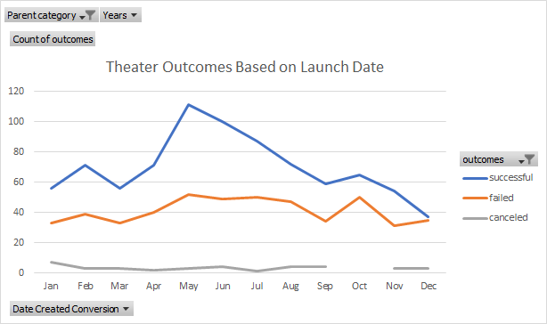
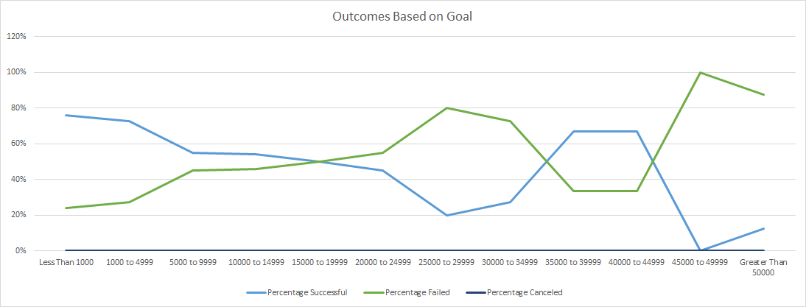

# Kickstarting with Excel

## Overview of Project

### Purpose

The project is dedicated to the analysis of theater campaigns launched on Kickstarter platform - need to find out the relation between campaign success and it's budget and also with launch date of the theater project.

## Analysis and Challenges

### Analysis of Outcomes Based on Launch Date

Using information about campaigns launch date and their results we created a pivot table to show how many theater projects were successful or failed or were canceled in a particular month. Based on this pivot table the chart below shows that chances are higher to run a successful theater project during May-June. Chances to run a successful campaign are decreasing by the end of the year and it is definitely not a good idea to launch a project in December. Quantity of canceled projects stay on the same level during the whole year.

    

### Analysis of Outcomes Based on Goals

Using information regarding theater plays budget and their results we created a table showing percentage of successful and failed plays within each range of their budgets. For a better visibility of results please see below a line chart built based on the obtained results. It is obvious that majority of successful theater plays had a goal less than $5,000. The more expensive the play - the less chances to achieve the goal.   

  

### Challenges and Difficulties Encountered

Though there were no challenges to create a pivot table it was a little tricky to get correct results for Outcomes Based on Goals using COUNTIFS. The main difficult is to make sure that there is a correct range in the formula for each cell so it is not possible just to drag the same formula for all goal ranges.

## Results

- What are two conclusions you can draw about the Outcomes based on Launch Date?

It is better to run a theater campaign on May and June where there are more successful campaigns.

It is not recommended to run a theater project in the end of the year, especially on December.

- What can you conclude about the Outcomes based on Goals?

Majority of successful theater plays had a goal less than $5,000. So it is better to keep this budget level.

- What are some limitations of this dataset?

Louise’s play Fever didn't reach the goal though she had a budget less than $5,000 and her campaign was launched in June. There could be other reasons of why her play didn't become successful. It would be useful to have other criteria in Kickstarter data set like genre or reviews based on a poll if this campaign is interesting to other people or not.

- What are some other possible tables and/or graphs that we could create?

It is also possible to build a column chart to show quantity of successful / failed campaigns for each parent category. Or a box plot for goals amounts to see statistical data for further analysis.
